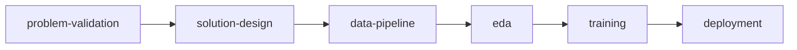
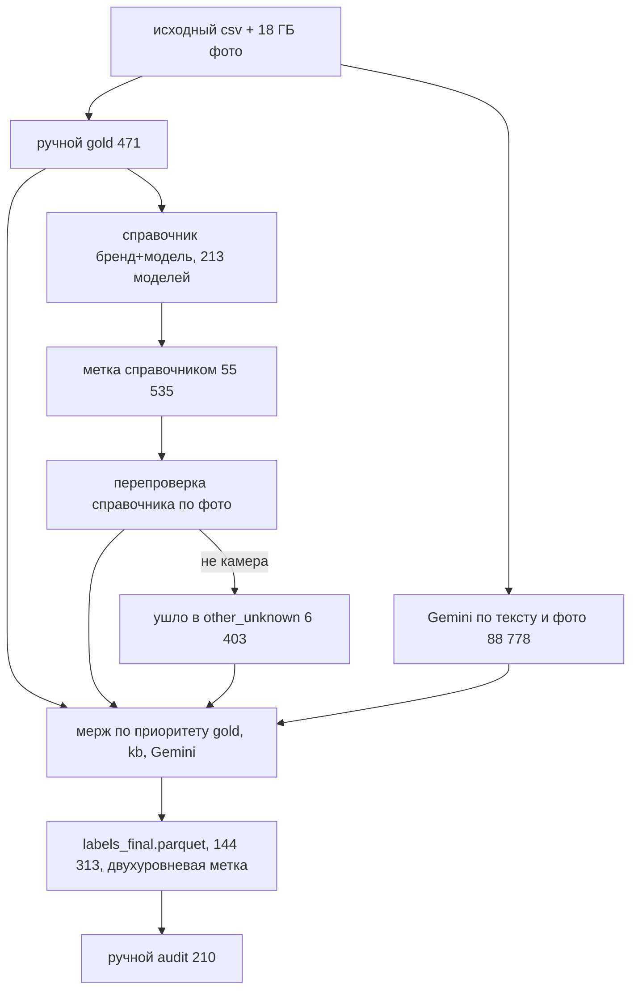
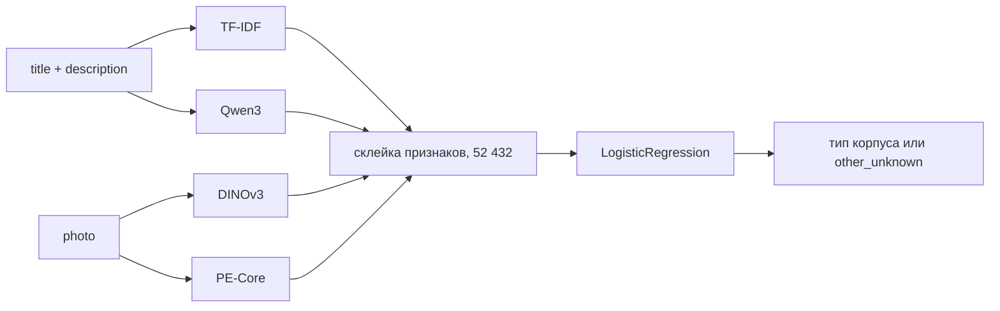
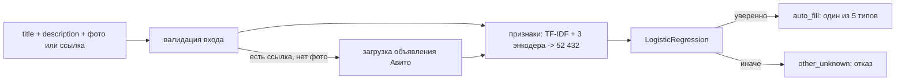

# Тип корпуса плёночной камеры по объявлению Авито

Проект про автозаполнение `film_camera_body_type` в объявлениях Авито с плёночными фотоаппаратами

- категория: Электроника / Фототехника / Плёночные фотоаппараты
- вход: заголовок, описание, фото или ссылка на объявление
- выход: один из пяти типов корпуса или `other_unknown`, если лучше не заполнять поле

Я выбрал один параметр для узкой категории и довёл его до сервиса: проверил идею, собрал разметку, разобрал данные, обучил модель и прогнал нагрузку. Ниже короткая карта проекта, подробности - в папках этапов

## Живой сервис

| что | где |
|---|---|
| демка | https://superbosss-avito-camera-body-type.hf.space |
| Swagger | https://superbosss-avito-camera-body-type.hf.space/docs |
| Space | https://huggingface.co/spaces/SuperBOSSS/avito-camera-body-type |
| код сервиса | [deployment/](deployment/) |
| отчёт нагрузки | [deployment/loadtest/report.html](deployment/loadtest/report.html) |

Бесплатный CPU Space засыпает. Первый запрос после простоя может идти дольше: модель заново грузится. После старта ответы идут быстрее

## Результат

| что | значение |
|---|---|
| данные | 144 313 объявлений: заголовок + описание + фото |
| разметка | 471 ручной gold, справочник моделей, Gemini-разметка, проверка справочника по фото, ручной audit 210 |
| модель | TF-IDF + Qwen3 + DINOv3 + PE-Core -> LogisticRegression, 52 432 признака |
| бейзлайн (справочник) | CAR 0.357 на ручном audit |
| val | CAR 0.787, AER 0.041 |
| test по Gemini (22k) | CAR 0.835, AER 0.037 |
| ручной audit (210) | CAR 0.748, AER 0.025 |
| нагрузка | 1767 запросов, 0 ошибок, 2.37 rps |

На ручном audit модель правильно заполняет **74.8%** объявлений. У справочника-бейзлайна было **35.7%**. Среди заполненных строк ошибка **2.5%**, это ниже лимита 5%

Audit маленький: всего 210 строк. Если считать ошибку с запасом, получается 6.2%. Поэтому модель выбиралась по val, а audit остался финальной проверкой на человеке

Оценка на test по Gemini выше: CAR 0.835, AER 0.037. Я держу её отдельно: модель училась на Gemini-разметке, а Gemini тоже ошибается. Разбор - в [training](training/README.md)

## Задача и классы

| класс | смысл |
|---|---|
| `SLR` | однообъективная зеркальная камера |
| `TLR` | двухобъективная камера |
| `rangefinder_viewfinder` | дальномерная, шкальная или видоискательная камера |
| `compact_point_and_shoot` | компактная авто-камера, мыльница |
| `instant` | моментальная печать, Polaroid или Instax |
| `other_unknown` | не заполнять: не камера, лот, аксессуар, цифровая камера или случай вне схемы |

Пять классов можно использовать как значения фильтра. `other_unknown` - отказ сервиса: если тип выбрать нельзя, лучше оставить поле пустым, чем отправить объявление не в тот фильтр. Дальномерные и простые видоискательные камеры я объединил: по фото без знания модели их часто не различить. Средний формат не стал отдельным классом, потому что это размер кадра, а не форма корпуса. Полная постановка и контракт ответа - в [solution-design](solution-design/README.md)

## Почему параметр нужен

Сначала я проверил саму категорию. В ней около **60 тысяч** активных объявлений (59 758 на момент проверки), а фильтра по типу корпуса нет - ни в выдаче, ни в форме подачи. Поэтому покупатель ищет не тип, а конкретные модели: `Зенит`, `Polaroid`, `Instax`, `Olympus mju`

На ручном срезе из **49** свежих карточек тип почти всегда читается: по главному фото в **78%** случаев, по всем фото в **92%**, а бренд или модель есть в заголовке у **92%** карточек

При этом сам тип словами почти не пишут. Строгие слова вроде "зеркальный", "мыльница", "дальномер" встретились в **4%** заголовков, с синонимами - в **14%**. Справочник моделей закрывает частые случаи, но ломается на бедных заголовках, лотах и аксессуарах, поэтому одной эвристики мало. Скрины и расчёты - в [problem-validation](problem-validation/README.md)

## Что я сделал по этапам

| этап | что сделал | что получилось |
|---|---|---|
| проверка идеи | прошёл выдачу, форму подачи и 49 карточек руками | фильтра по типу нет, тип чаще всего виден по фото и тексту |
| схема и метрика | зафиксировал 5 классов, отказ и бизнес-метрику | метрика отдельно считает пользу и ошибки |
| разметка | ручной gold, справочник, Gemini, проверка по фото | 144 313 строк с двухуровневой меткой, точность принятых меток 96.2% |
| EDA | проверил дубли, продавцов, классы, источники меток | случайное разбиение завышает качество, поэтому нужны группы |
| обучение | начал со справочника, добавлял текст и фото по блоку | лучшей стала простая LogisticRegression поверх готовых признаков |
| сервис | завернул модель в FastAPI: страница, Swagger, Docker, мониторинг | публичный сервис держит больше 1 rps |

## Путь проекта



- [problem-validation](problem-validation/README.md) - стоит ли решать задачу, оценка по ручному срезу карточек
- [solution-design](solution-design/README.md) - схема сервиса, 5 классов, отказ, бизнес-метрика и контракт ответа
- [data-pipeline](data-pipeline/README.md) - разметка: 12 стадий, Gemini, справочник моделей и ручной audit
- [eda](eda/README.md) - дубли, утечки, дисбаланс классов и выводы для разбиения
- [training](training/README.md) - лестница экспериментов, валидация без утечек, анализ ошибок, финальная модель
- [deployment](deployment/README.md) - FastAPI-сервис, Docker, мониторинг и нагрузочный тест

## Данные и разметка



Данные дал Артём Васенков (@aavasenkov), потому что вручную распарсить категорию не вышло: Авито закрывает массовое скачивание

В выдаче я видел около 60 тысяч активных объявлений, но в дампе оказался весь индекс категории вместе с архивными - **144 313** объявления. У каждого есть заголовок, описание и одно фото

Фото лежали в S3-совместимом хранилище под кредами. Скрипт зеркалит их в `data/raw`: это **18 ГБ**, в git они не лежат. Бюджета на разметку не было, платил из своих, всё вышло около **$38** с налогами

Готовой разметки не было, поэтому я собрал её сам:

| источник | сколько |
|---|---:|
| ручной gold | 471 |
| справочник, 213 моделей | 55 535 |
| Gemini по тексту и фото | 88 778 |
| ушло в `other_unknown` по фото | 6 403 |
| ручной audit | 210 |

Сначала я вручную разметил 471 gold-строку, по ним собрал справочник `бренд + модель -> тип` на 213 моделей и проставил метку 55 535 объявлениям. Остальные 88 778 строк разметил Gemini по тексту и фото. Справочник на ручной выборке сначала выглядел сильным, но на случайных строках просел до 83%: текстом он не ловит лоты и чехлы, где модель названа, а на фото не камера. Поэтому я перепроверил все метки справочника по фото: **6 403** строки оказались лотами, аксессуарами или похожими случаями и ушли в `other_unknown`. На финальной ручной проверке 210 строк точность принятых меток вышла **96.2%** при цели 95%

Метка двухуровневая. Сначала я определяю, одиночная это плёночная камера или нет. Если да - ставлю тип корпуса. Если нет - `other_unknown`. Так ошибки видно раздельно: путает модель типы камер или вообще приняла лот за камеру. Стадии пайплайна, разбор справочника и audit - в [data-pipeline](data-pipeline/README.md)

## Что показал EDA

EDA помог найти места, где легко завысить качество. Главное:

- в данных много повторов: **94 305** продавцов, но один топ держит **1 375** объявлений, одинаковые заголовки у **63%** строк, есть точные дубли фото (1 217 групп) - случайное разбиение разнесло бы похожие объявления в train и test и завысило качество
- `TLR` редкий - **1.30%** датасета (1 879 строк), поэтому одной общей метрики мало, классы надо смотреть отдельно
- `other_unknown` - **18.80%** и разнородный: внутри лоты, аксессуары, цифровые камеры, коробки и бедные объявления
- справочник по моделям без проверки фото ошибается на лотах и аксессуарах: в тексте есть модель, а на фото может быть не камера
- текст часто выдаёт модель камеры, но похожие тексты нельзя разводить между train и test

Из-за этого я разбил данные по группам: продавец, хеши фото и хеш текста не пересекаются между train, val и test. Полный разбор - в [eda](eda/README.md)

## Метрика

Обычная точность здесь мало что говорит: она не различает отказ и неверное заполнение, а для каталога это разные вещи. Неверный тип уводит объявление в чужой фильтр, отказ просто оставляет поле пустым. Поэтому я считаю две метрики:

```text
CorrectAutofillRate = верные автозаполнения / все объявления
AutoErrorRate       = ошибки / все автозаполненные объявления
```

Цель - дать как можно больше правильных автозаполнений и держать ошибку среди заполненных не выше 5%. Пилот считаю успешным при CAR >= 70% и AER <= 5%. 70% я взял как нижнюю планку пользы: для категории с примерно 60 тысячами активных объявлений это около 42k правильно заполненных полей. Лимит ошибок нужен, чтобы не загрязнять каталог неверными значениями. Подробнее - в [solution-design](solution-design/README.md)

## Модель



Большую сеть я не дообучал: GPU-бюджета нет, а сервис должен работать на CPU. Поэтому я перенёс разметку Gemini в лёгкую модель. Готовые энкодеры считают признаки, сверху работает `LogisticRegression`. GPU понадобился только для эмбеддингов на Kaggle, всё остальное считается на CPU

Финальный вектор - 52 432 признака:

```text
title + description -> TF-IDF 50000
text                -> Qwen3-Embedding-0.6B 1024, L2
photo               -> DINOv3 vits16 384, L2
photo               -> PE-Core-L-14-336 1024, L2

[все признаки] -> LogisticRegression(C=1.0, class_weight=None) -> 5 классов + отказ, tau=0
```

Справочник был первым бейзлайном и дал CAR **0.357** на ручном audit. Он точный, когда модель камеры явно написана в тексте, но срабатывает редко. Дальше я добавлял по блоку - TF-IDF + DINOv3, потом Qwen3, потом PE-Core - и поднял CAR до **0.748** на том же audit. Текст и фото по отдельности хуже, лучший результат появился, когда я склеил оба сигнала. Более сложные варианты (бустинги, склейка предсказаний) лучше совпадали с Gemini, но на ручном audit лучше не становились. Поэтому чемпионом осталась простая logreg

Валидация защищена от утечек: разбиение заморожено, связанные строки (один продавец, одинаковое фото по хешам, одинаковый текст) целиком уходят в одну часть, пересечений между train, val и test нет. В признаки не попадают источник метки, модель из справочника и сырые ответы Gemini. TF-IDF и скейлеры обучаются только на train

Загрузить финальную модель (бандл лежит в git):

```python
import joblib

bundle = joblib.load('training/final_model/tfidf_qwen3_dinov3_pe_logreg_reg1_0_unweighted_final_pipeline.joblib')
clf, tau, labels = bundle['classifier'], bundle['tau'], bundle['labels']
```

Порядок блоков, имена энкодеров и размерности зафиксированы в `training/final_model/*_meta.yaml`

## Где модель ошибается

Чаще всего проблема не в типе камеры, а в самом объявлении. Модель видит известное название камеры и иногда пропускает контекст вокруг:

- лот из нескольких камер, где в тексте есть известная модель
- аксессуар или видоискатель вместо камеры
- цифровая камера, попавшая в категорию плёнки
- кинокамера (`Красногорск-3` уходит в SLR)
- граница `compact_point_and_shoot` / `rangefinder_viewfinder` и редкие модели

Среди ошибок автозаполнения чаще встречается лишнее заполнение там, где надо было отказаться. Ошибок между типами меньше. Многие промахи уверенные, поэтому простые правила по словам их не чинят. Я отдельно проверял пороги, каскад "камера / не камера", отдельную модель отказа, ручные правила, склейку предсказаний и kNN. На ручном audit они не дали устойчивого выигрыша: чаще убирали верные ответы. Поэтому я оставил простую модель. Анализ ошибок и отчёты - в [training](training/README.md)

## Сервис и нагрузка



Сервис лежит в `deployment/`: FastAPI, страница с формой в стиле Авито, API, Swagger и метрики. На вход можно подать заголовок, описание и фото или ссылку на объявление. По ссылке сервис сам пытается достать заголовок и фото. Модель и три энкодера грузятся один раз на старте

| метод | путь | назначение |
|---|---|---|
| `GET` | `/` | страница с формой |
| `POST` | `/predict` | предсказание по тексту, фото или ссылке -> JSON |
| `GET` | `/health` | проверка живости |
| `GET` | `/metrics` | метрики Prometheus |
| `GET` | `/docs` | Swagger |

В ответе приходит тип или отказ, уверенность и вероятности по классам:

```json
{
  "attribute": "film_camera_body_type",
  "value": "SLR",
  "decision": "auto_fill",
  "confidence": 0.96,
  "reason": "model_argmax",
  "probabilities": {
    "SLR": 0.96,
    "rangefinder_viewfinder": 0.02,
    "compact_point_and_shoot": 0.01,
    "TLR": 0.0,
    "instant": 0.0,
    "other_unknown": 0.01
  }
}
```

Образ собирается одним `Dockerfile` в корне: python:3.13-slim, torch CPU-колесом, веса трёх энкодеров запекаются на сборку, рантайм офлайн. Мониторинг - Prometheus и Grafana: 12 панелей по запросам, ошибкам, задержке, классам и отказам. В Grafana настроены 6 алертов: сервис недоступен, модель не загружена, растут 5xx, высокая задержка, слишком частый отказ и падает уверенность. Уведомления уходят в Telegram. Нагрузку гонял Locust на шести разных объявлениях, кэш ответов не использовался: **1767** запросов, **0** ошибок, **2.37 rps**, p95 около 2 секунд. Три энкодера на CPU тяжёлые, но требование 1 rps сервис держит. Полная инструкция, мониторинг и деплой на HF Spaces - в [deployment](deployment/README.md)

## Как запустить сервис

Перед сборкой нужен `.env` с HF-токеном. DINOv3 закрытый, поэтому скачивается по токену во время сборки:

```bash
set -a; source .env; set +a
DOCKER_BUILDKIT=1 docker build --secret id=hf_token,env=HF_TOKEN -t film-camera .
docker run --rm -p 8010:7860 film-camera
```

После запуска:

```text
страница: http://localhost:8010
Swagger:  http://localhost:8010/docs
health:   http://localhost:8010/health
```

Проверка и пример запроса по фото:

```bash
curl -i http://localhost:8010/health
curl -i -F 'title=Зенит-Е' -F 'description=плёночный зеркальный фотоаппарат' \
  -F 'photos=@deployment/loadtest/samples/img/slr.jpg' \
  http://localhost:8010/predict
```

## Как повторить обучение

```bash
python -m venv .venv && source .venv/bin/activate    # Python 3.13
pip install -r requirements.txt
python training/src/train.py                          # текущий список конфигов из experiments.py
python training/src/train.py --all                    # весь каталог конфигов
python training/src/final_refit.py                    # финальная модель: обучение на train+val
bash training/tracking/ui.sh                          # MLflow UI на http://127.0.0.1:5000
```

Эмбеддинги считаются один раз на Kaggle GPU ноутбуками `training/notebooks/extract_*.ipynb` и кладутся в `training/artifacts/embeddings/`. В git они не лежат. Для обучения нужны готовые эмбеддинги, а сами энкодеры нужны только в сервисе

## Чего нет в git

В репозитории только код, README этапов, отчёты, манифест разбиения и финальный бандл модели. Тяжёлое и приватное не коммитится:

| что | почему |
|---|---|
| `data/raw/` | около 18 ГБ фото и исходный csv |
| `*.parquet`, `training/artifacts/` | тяжёлые датасеты, эмбеддинги и предсказания |
| `training/tracking/store/` | локальная база MLflow, для отчёта хватает `reports/experiments_summary.csv` |
| веса Qwen3 / DINOv3 / PE-Core | скачиваются при сборке Docker-образа |
| `.env` | токены |

## Структура репозитория

| папка | что внутри |
|---|---|
| `problem-validation/` | `notebooks/`, `scripts/`, ручные метки и скрины Авито |
| `solution-design/` | README со схемой сервиса и метрикой |
| `data-pipeline/` | `pipeline/` (12 стадий), `prompts/`, `lib/`, `tools/`, `reflection.md` |
| `eda/` | `eda.ipynb` и README с выводами |
| `training/` | `src/`, `validation/`, `reports/`, `final_model/`, `tracking/` |
| `deployment/` | `app/`, `templates/`, `static/`, `monitoring/`, `loadtest/`, `tests/` |
| `data/` | `taxonomy.yaml`, `decision_rules.md`, `manifest.yaml`; тяжёлые данные не в git |

## Ограничения

- большая часть обучающих меток пришла от Gemini; если Gemini ошибался, модель могла это повторить
- ручной audit маленький, 210 строк: по нему я проверяю перенос на человека, но не выбираю между близкими моделями
- сервис держит больше 1 rps, но задержка заметная: три энкодера считаются на CPU
- ссылку на Авито не всегда удаётся разобрать: если страницу или фото не удалось открыть, сервис возвращает `other_unknown`
- сырые данные и фото не лежат в git: там около 18 ГБ, плюс приватные данные и токены

## Код-стайл

Код разложен по модулям, а не в один большой скрипт. Сервис лежит в `deployment/app/`: входы, энкодеры, сборка вектора, решение, метрики и страница. Обучение - в `training/src/`. Линтеры и тесты:

```bash
ruff check .
flake8 .
cd deployment && pytest        # 12 тестов, без загрузки тяжёлых энкодеров
```

`ruff` и `flake8` настроены на длину строки 120. Конфиги лежат в `pyproject.toml` и `setup.cfg`

## Команда

- Команда: Чувал
- Капитан: Лосев Никита, проект выполнен индивидуально
- Тема 05: определение параметров товара по тексту и фото
