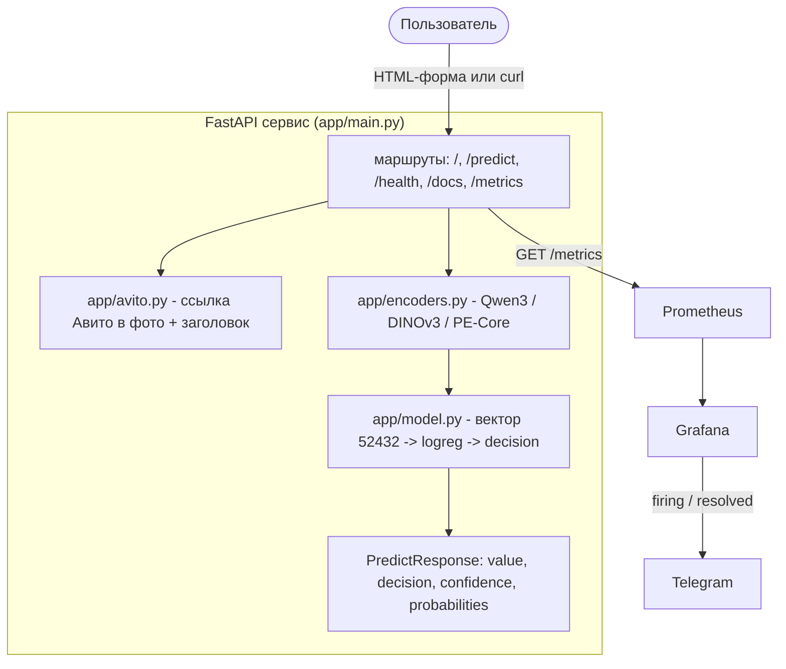
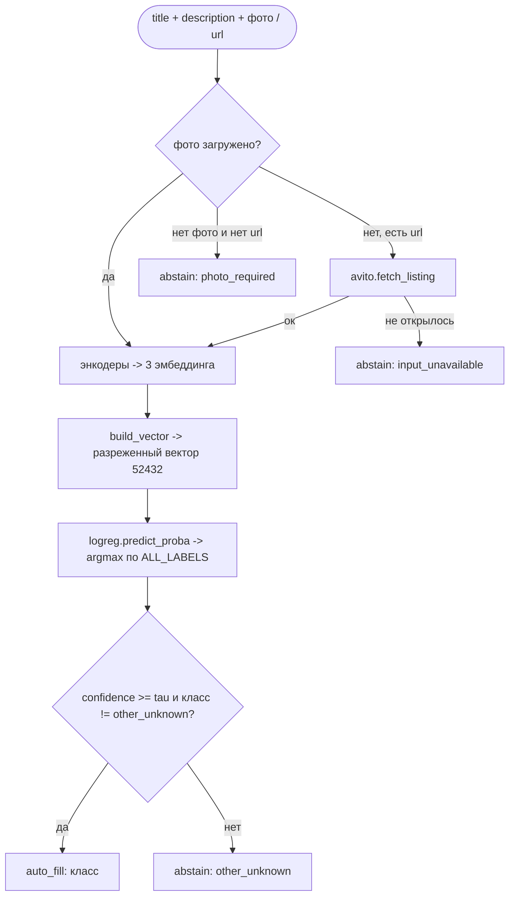
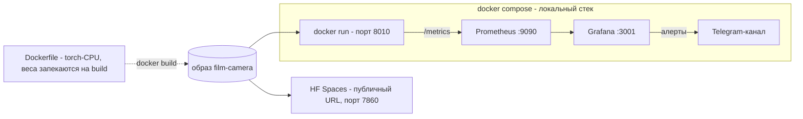

# Сервис определения типа корпуса плёночной камеры

Сервис определяет `film_camera_body_type` по объявлению Авито. Внутри: FastAPI, страница в стиле
Авито, JSON API, Swagger, метрики Prometheus, Grafana, Locust-тест и публичный деплой в Hugging Face Spaces

| что | ссылка |
|---|---|
| живой сервис | https://superbosss-avito-camera-body-type.hf.space |
| Space | https://huggingface.co/spaces/SuperBOSSS/avito-camera-body-type |
| Swagger | https://superbosss-avito-camera-body-type.hf.space/docs |

> Код сервиса - в `deployment/`, `Dockerfile` - в корне репозитория

## Что это

Сервис принимает заголовок, описание и фото камеры. Ещё можно передать ссылку на объявление Авито.
На выходе - тип корпуса или `other_unknown`, если лучше не заполнять поле. Модель использует и текст,
и фото. Постановка задачи - в `solution-design/`

### Классы

| класс | как показываю на странице | решение |
|---|---|---|
| `SLR` | Зеркальная | `auto_fill` |
| `TLR` | Двухобъективная | `auto_fill` |
| `rangefinder_viewfinder` | Дальномерная | `auto_fill` |
| `compact_point_and_shoot` | Компактная «мыльница» | `auto_fill` |
| `instant` | Моментальная (Polaroid/Instax) | `auto_fill` |
| `other_unknown` | Не заполнять | `abstain` |

`other_unknown` означает отказ от автозаполнения. Так сервис отвечает, если не уверен, на фото не камера, фото нет или ссылка не открылась. Лучше оставить поле пустым, чем подставить неверный тип

## Архитектура

Основной сервис один. Мониторинг и нагрузочный тест лежат рядом



### Как считается предсказание



## Структура кода

Код разложен по модулям - отдельно входы, энкодеры, сборка признаков, решение модели, метрики и HTML-страница

| модуль | что делает |
|---|---|
| `app/config.py` | константы и пути: классы, размерности блоков, имена моделей, RU-лейблы |
| `app/schemas.py` | Pydantic-схема ответа `PredictResponse` |
| `app/model.py` | сборка вектора, вероятности, финальное решение; класс `Predictor` |
| `app/encoders.py` | Qwen3, DINOv3 и PE-Core, грузятся один раз |
| `app/avito.py` | парсер объявления Авито (best-effort: заголовок + фото) |
| `app/images.py` | открыть фото и собрать data-URI для превью на странице |
| `app/metrics.py` | метрики Prometheus и вспомогательная функция `record` |
| `app/main.py` | FastAPI: маршруты, lifespan (модель грузится один раз), рендер страницы |
| `monitoring/` | Prometheus, Grafana и дашборд |
| `loadtest/` | нагрузочный тест Locust + сэмпл-объявления |
| `tests/` | самопроверка контракта, API, метрик, парсера (без загрузки моделей) |

`torch` нужен только в `encoders.py`. Поэтому `model.py` и тесты можно запускать без тяжёлых моделей:
в тестах я подставляю короткие фейковые эмбеддинги и проверяю, что предсказание считается правильно

## Модель

Готовая модель `training/final_model/*.joblib` - логистическая регрессия (`C=1.0`, без весов классов,
обучена на train+val) поверх объединённого вектора признаков 52432:

| блок | источник | размерность | нормировка |
|---|---|---|---|
| tfidf | заголовок + описание | 50000 | - |
| Qwen3-Embedding-0.6B | текст | 1024 | L2 |
| DINOv3 vits16 | фото | 384 | L2 |
| PE-Core-L-14-336 | фото | 1024 | L2 |

Порог отказа `tau = 0`: сервис принимает все предсказания основных классов. Признаки считаются так же,
как на обучении. На отложенном test: CAR около 0.835, AER около 0.037

## Зависимости и установка

Основной способ запуска - Docker. В образ ставится CPU-версия torch, а веса энкодеров скачиваются во время
сборки. Локально без Docker тоже можно:

```bash
.venv/bin/pip install -r deployment/requirements.txt
```

## Запуск

### Docker

Для сборки нужен HF-токен с доступом к DINOv3. Кладём в `.env` в корне репозитория:

```bash
HF_TOKEN=hf_...
```

Токен передаётся как BuildKit secret и не попадает в образ. После сборки сервис работает без скачивания весов:

```bash
# из корня репозитория
set -a
source .env
set +a
DOCKER_BUILDKIT=1 docker build --secret id=hf_token,env=HF_TOKEN -t film-camera .
docker run --rm -p 8010:7860 film-camera        # http://localhost:8010
```

Сборка скачивает CPU-версию torch и 3 энкодера. У меня это занимает около 10-20 минут, образ получается около 6-8 ГБ. Контейнер запускается не от root и слушает порт 7860

### Локально без Docker

```bash
cd deployment && ../.venv/bin/uvicorn app.main:app --host 0.0.0.0 --port 8010
```

### Полный стек (сервис + Prometheus + Grafana)

После сборки образа `film-camera`: `cd deployment/monitoring && docker compose up`

## Примеры запроса

В примерах ниже локальный адрес - `http://localhost:8010`. В публичной версии вместо него можно использовать `https://superbosss-avito-camera-body-type.hf.space`

Проверка живости:

```bash
curl -i http://localhost:8010/health
# 200 {"status":"ok"}
```

Предсказание по фото (multipart), фото берём из сэмплов нагрузки:

```bash
curl -i -F 'title=Зенит-Е' -F 'description=плёночный зеркальный фотоаппарат' \
  -F 'photos=@deployment/loadtest/samples/img/slr.jpg' \
  http://localhost:8010/predict
```

По ссылке на объявление (если фото не загружено - берётся фото со страницы Авито):

```bash
curl -i -F 'url=https://www.avito.ru/.../instax_mini_11_...' http://localhost:8010/predict
```

В ответе приходят `value`, `decision`, `confidence` и `probabilities`. Если фото нет, ссылка не открылась
или модель отказалась, `value = other_unknown`. Если переданы и фото, и ссылка, сервис использует загруженное фото

## API и Swagger

Swagger доступен на `/docs`, ReDoc - на `/redoc`. Основные маршруты:

| метод | путь | назначение |
|---|---|---|
| `GET` | `/` | страница с формой (HTML) |
| `POST` | `/predict` | предсказание по multipart (title/description/url/photos) -> JSON |
| `GET` | `/health` | проверка живости -> `{"status":"ok"}` |
| `GET` | `/metrics` | метрики Prometheus |
| `GET` | `/docs` | Swagger UI |

## Мониторинг (Prometheus + Grafana)

Сервис отдаёт метрики на `GET /metrics`: число запросов, задержку, уверенность модели, загруженность
модели и HTTP-статусы. Локальный стек поднимается так:

```bash
cd deployment/monitoring
docker compose up -d
```

После запуска доступны:

| что | адрес |
|---|---|
| сервис | http://localhost:8010 |
| Prometheus | http://localhost:9090 |
| Grafana | http://localhost:3001 (admin / admin) |

В Grafana один раз добавляем Prometheus с URL `http://prometheus:9090` и импортируем
`grafana/film_camera_service.json`. На дашборде 12 панелей: запросы, ошибки, классы, `auto_fill` / `abstain`,
задержка, уверенность и `model_loaded`

### Алерты

В Grafana настроены 6 правил, уведомления отправляются в Telegram через Contact point. Правила:

| алерт | query | условие | for |
|---|---|---|---|
| Сервис недоступен | `up{job="film_camera_service"}` | ниже 1 | 1m |
| Модель не загружена | `max(model_loaded)` | ниже 1 | 1m |
| Доля ошибок 5xx | `sum(rate(http_requests_total{status=~"5.."}[5m])) / sum(rate(http_requests_total[5m]))` | выше 0.05 | 2m |
| Высокая p95 latency | `histogram_quantile(0.95, sum by(le)(rate(http_request_duration_seconds_bucket{method="POST"}[5m])))` | выше 10 | 5m |
| Высокий abstain | `sum(rate(predict_requests_total{decision="abstain"}[10m])) / clamp_min(sum(rate(predict_requests_total[10m])),0.001)` | выше 0.7 | 10m |
| Падение уверенности (дрейф) | `rate(predict_confidence_sum[10m]) / rate(predict_confidence_count[10m])` | ниже 0.6 | 10m |

## Нагрузка (Locust)

На каждый запрос Locust берёт случайное объявление из шести (`loadtest/samples.py` + фото в
`loadtest/samples/img/`, по одному на класс) и шлёт на `/predict`. Входы разные каждый запрос - кэш не задействован

```bash
.venv/bin/pip install locust        # из корня репо, один раз
# терминал 1 - сервис (именно 0.0.0.0)
cd deployment && ../.venv/bin/uvicorn app.main:app --host 0.0.0.0 --port 8010
# терминал 2 - нагрузка, web-UI на :8089
cd deployment/loadtest && ../../.venv/bin/locust -f locustfile.py --host http://localhost:8010
```

Без UI, сразу HTML-отчёт:

```bash
cd deployment/loadtest && ../../.venv/bin/locust -f locustfile.py --host http://localhost:8010 \
  --users 4 --spawn-rate 1 --run-time 2m --headless --html report.html
```

Результат прогона (4 пользователя, spawn rate 1, отчёт [`loadtest/report.html`](./loadtest/report.html)):

| метрика | значение |
|---|---:|
| запросов | 1767 |
| ошибок | 0 |
| средний RPS | 2.37 |
| p50 / p95 / p99 | 1300 / 2000 / 2900 мс |
| макс. задержка | 4371 мс |

Без кэша держит больше 1 rps, 5xx не было. Задержка большая - три энкодера считаются на CPU

## Публичный деплой (HF Spaces)

На HF Spaces собирается тот же `Dockerfile`. В Space-репозиторий кладу только то, что нужно образу:
код сервиса, зависимости и финальную модель



Как деплоил Space: создал Docker Space, добавил secret `hf_token`, собрал чистый Space-репозиторий
и запушил его. Для `.joblib` нужен `git-lfs`:

```bash
git clone https://huggingface.co/spaces/<user>/<space> hf-space && cd hf-space
SRC=~/Documents/avito-film-camera-body-type
cp "$SRC/Dockerfile" "$SRC/.dockerignore" .
mkdir -p deployment training
cp -r "$SRC/deployment/app" "$SRC/deployment/static" "$SRC/deployment/templates" deployment/
cp "$SRC/deployment/requirements.txt" deployment/requirements.txt
cp -r "$SRC/training/final_model" training/final_model
cat > README.md <<'EOF'
---
title: Тип корпуса плёночной камеры
sdk: docker
app_port: 7860
pinned: false
---

# Определение типа корпуса плёночной камеры

Сервис по объявлению Авито определяет тип корпуса плёночной камеры. Внутри FastAPI, страница с формой,
API на /predict и Swagger на /docs
EOF
find . -name __pycache__ -type d -exec rm -rf {} +
git add -A && git commit -m "film-camera service" && git push
```

На бесплатном CPU Space первый запрос после простоя может быть долгим: сервис просыпается и заново
грузит модель. Дальше отвечает за пару секунд
