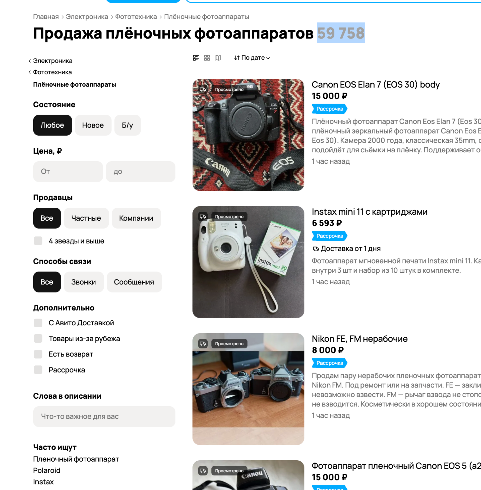
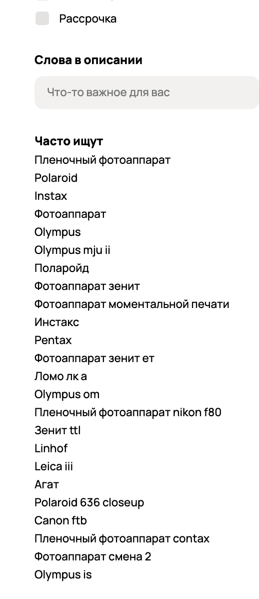
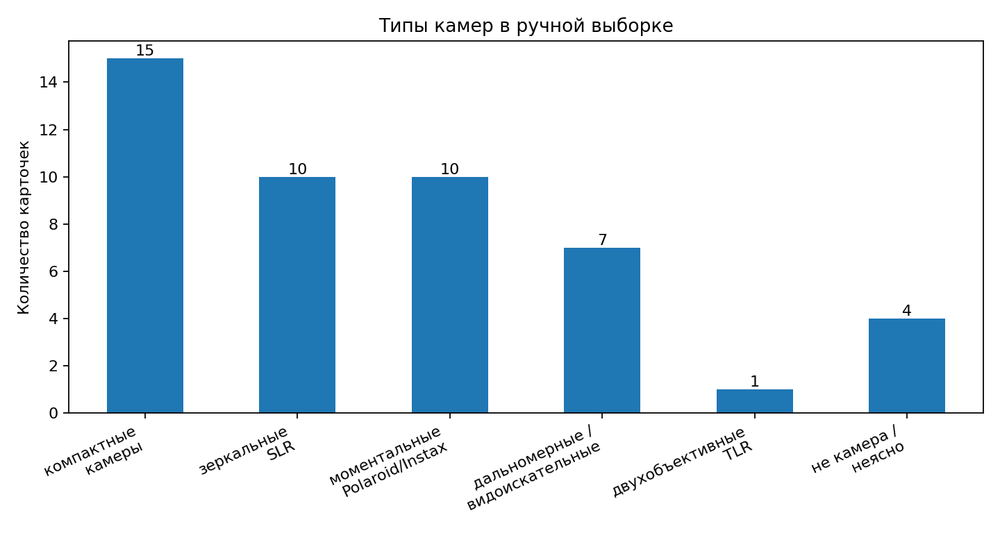
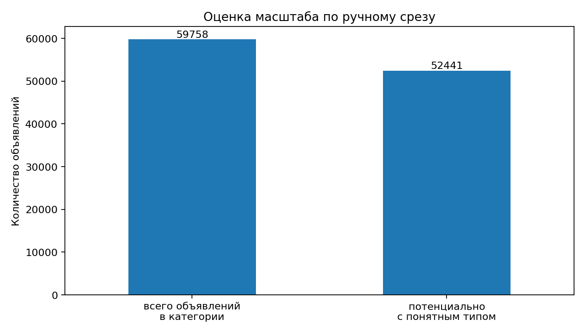
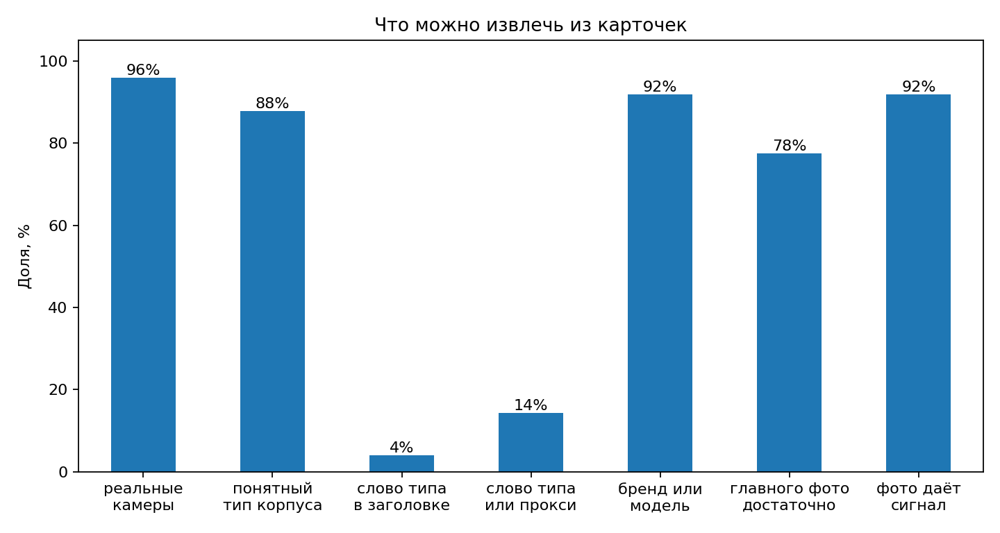
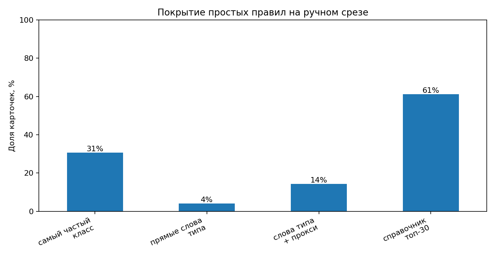
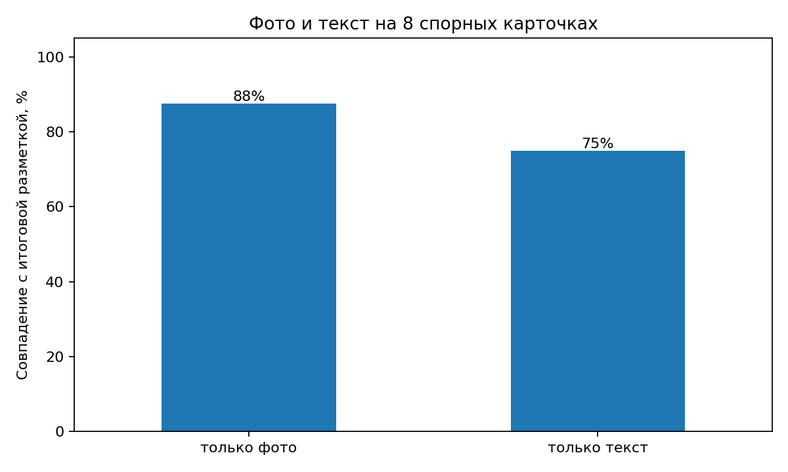
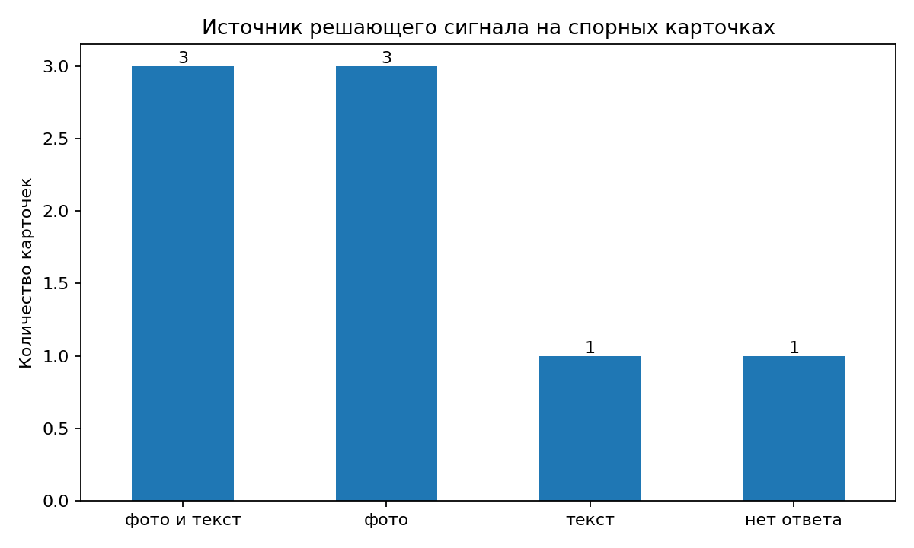

# Оценка проекта до взятия в работу

Проект: определение типа корпуса плёночной камеры по объявлению Авито.  
Категория: Электроника / Фототехника / Плёночные фотоаппараты.  
Параметр: `film_camera_body_type`.  
Папка этапа: `problem-validation/`.

Классы, которые я беру в работу:

| Значение | Как это выглядит для пользователя |
|---|---|
| `compact_point_and_shoot` | мыльница, компактная автоматическая камера, одноразовая камера |
| `SLR` | зеркальная плёночная камера |
| `rangefinder_viewfinder` | дальномерная, шкальная или видоискательная камера без зеркальной призмы |
| `TLR` | двухобъективная камера |
| `instant` | Polaroid, Instax, камера моментальной печати |
| `other_unknown` | лот из разных камер, коробка, аксессуар, цифровая камера, форматная камера или другой случай вне выбранной схемы |

Почему я объединил `rangefinder` и `viewfinder` в один класс: по фото из объявления часто нельзя точно сказать, настоящая это дальномерка или просто камера с видоискателем - для этого нужно знать конкретную модель. Различать их между собой можно отдельным параметром, но для первой версии схемы это усложнит задачу и разметку.

Средний формат плёнки не беру как класс корпуса, потому что это характеристика плёнки и размера кадра, а не формы камеры. Среднеформатная камера сама по себе может быть TLR, SLR или дальномерной - это отдельная ось классификации, которую не стоит смешивать с типом корпуса.


## Главное

Я проверил категорию и решил брать этот параметр в работу. В выдаче было около 60k активных объявлений, но отдельного поля "тип корпуса" ни в фильтрах, ни в форме подачи я не нашёл. Поэтому покупатель ищет не тип камеры, а конкретные модели: `Зенит`, `Polaroid`, `Instax`, `Olympus mju`. Эту нехватку видно прямо в блоке "Часто ищут" под фильтрами: пользователи руками вбивают "пленочный", "polaroid", "instax", "зенит", то есть пытаются отфильтровать категорию по типу через свободный поиск.

Потом я руками посмотрел 49 свежих карточек. Категория оказалась достаточно чистой: чаще всего это реальные камеры, а ответ можно найти либо в тексте, либо на фото. Одних слов класса мало: "зеркальный", "мыльница", "дальномер" и похожие слова встретились только в 4% заголовков. Справочник `бренд + модель -> тип` работает лучше, но его надо постоянно поддерживать, а часть объявлений всё равно остаётся без ответа.

| Что проверял | Цифра | Что это значит |
|---|---:|---|
| Чистота категории | 96% реальные камеры, 91% из них размечаемы | в ручном срезе категория в основном соответствует задаче |
| Сигнал в тексте | бренд или модель в заголовке у 92% карточек | текст часто даёт зацепку для справочника или модели |
| Сигнал в фото | главное фото даёт ответ в 78%, все фото - в 92% | фото часто помогает там, где текст бедный |
| Поиск по словам в заголовке | от 4% строго до 14% с синонимами | по одним словам класса покрытие слишком низкое |
| Объём категории | 59 758 активных объявлений | объём заметный даже для нишевого атрибута |

Файлы с расчётами: [data/avito_camera_labels.csv](data/avito_camera_labels.csv), [data/modality_check.csv](data/modality_check.csv), [notebooks/problem_eda.ipynb](notebooks/problem_eda.ipynb). Графики пересчитываются скриптом [scripts/make_charts.py](scripts/make_charts.py).


## Что я проверил руками

Я открыл категорию Авито "Плёночные фотоаппараты", поставил сортировку по дате и регион "Все регионы". В выдаче зафиксировал 59 758 активных объявлений. Среди доступных фильтров есть состояние, цена, продавец, доставка и поиск по словам в описании. Отдельного фильтра по типу корпуса камеры нет.



Блок "Часто ищут" я использую как косвенный признак спроса на более точную навигацию внутри категории. В нём встречаются Polaroid, Instax, Olympus mju ii, Зенит TTL, Leica iii, Lomo LC-A и "фотоаппарат моментальной печати". Эти запросы частично заменяют отсутствующий структурный фильтр.



Форму подачи я тоже проверял вручную. В ней есть название, фото, описание, состояние, цена, гео и контакты. В проверенной форме я не нашёл полей "тип корпуса", "тип камеры", "производитель", "модель" или "формат плёнки". Поэтому даже знающий продавец не может заполнить тип корпуса как отдельное структурное поле.

После этого я открыл первые 49 карточек и разметил их руками. Для каждой карточки смотрел заголовок, описание и фото. Основная таблица лежит в [data/avito_camera_labels.csv](data/avito_camera_labels.csv). На 8 трудных карточках я отдельно сделал три прохода: только фото, только текст, потом полная карточка. Эта проверка лежит в [data/modality_check.csv](data/modality_check.csv).




## Потенциал проекта

**Какую проблему решает проект**

В этой категории тип корпуса не хранится как отдельный структурный параметр. Информация о нём остаётся в свободном тексте заголовка, описания и на фотографиях, поэтому её нельзя напрямую использовать как фильтр в выдаче.

Для покупателя это означает, что часть сценариев поиска требует заранее знать модели или бренды. Например, для TLR это могут быть "Любитель", Rolleiflex или Yashica Mat; для SLR - Зенит, Nikon FM или Canon EOS; для моментальных камер - Polaroid или Instax. Блок "Часто ищут" подтверждает это косвенно: пользователи вводят не только общие запросы, но и бренды/модели-прокси для нужного типа камеры.

**Численная оценка масштаба**

В ручной выборке 43 из 49 карточек попали в содержательные классы. Если грубо перенести эту долю на 59 758 активных объявлений, получится:

59 758 * 43 / 49 ~ 52 450 карточек.

Поэтому потенциально новый атрибут может быть полезен примерно для 52-53k объявлений. Это предварительная оценка, а не точная статистика всей категории.



**Экономический эффект**

В публичной статье AvitoTech про классификацию объявлений описано, что через поиск по категориям проходит около 40% контактов между покупателем и продавцом, и что структурные параметры нужны, чтобы товары попадали в нужные подвыдачи. На плёночные камеры это число напрямую не переношу. Здесь для меня важнее сама логика: если тип корпуса станет отдельным полем, покупатель сможет фильтровать камеры по типу, а не искать конкретные модели. Для покупателя польза простая: можно фильтровать по типу камеры, а не помнить названия моделей. Для продавца польза в том, что объявление с бедным заголовком вроде "Фотоаппарат" всё равно сможет попасть в нужный фильтр.

Деньгами я это не считаю: для этого нужны внутренние показы, клики и контакты. На этом этапе я фиксирую только размер категории, отсутствие фильтра и ручной срез, где параметр чаще всего можно определить.


## Простое решение

**Есть ли простое решение**

Да, есть. Сильное простое решение - справочник "бренд+модель -> тип корпуса". В 45 из 49 заголовков есть бренд или модель, поэтому у справочника есть хороший текстовый сигнал. Но сам бренд не всегда достаточен: Canon, Nikon, Olympus и другие бренды встречаются в разных типах камер.

Наивный вариант через поиск слов класса в заголовке ("зеркальный", "мыльница", "дальномер", "TLR", "моментальный", "одноразовый") даёт слишком малое покрытие: 2 из 49 заголовков при строгом поиске и 7 из 49 при добавлении синонимов вроде Instax. Поэтому такой вариант можно использовать только как слабую эвристику, но не как основное решение.



**Насколько он решит задачу**

Справочник закрывает значительную часть категории, и это видно на лестнице решений:

| Решение | Результат / оценка покрытия | Что это даёт |
|---|---:|---|
| Самый частый класс | 15/47 = 32% среди камер | базовая точка отсчёта |
| Поиск слов класса в заголовке | 2/49 = 4% | слишком низкое покрытие |
| Поиск слов класса с синонимами | 7/49 = 14% | покрытие всё ещё слишком низкое |
| Справочник на топ-30 моделей | около 30/49 = 61% | покрывает часть популярных моделей и семейств |
| Справочник на 200+ моделей | гипотеза: до 80-85% | требует отдельной проверки и поддержки базы |



На ручном срезе справочник по топовым моделям выглядит значительно сильнее поиска слов класса. Оценку 80-85% для расширенного справочника я считаю гипотезой: её нужно проверять на большей выборке, а не подавать как финальный результат.

При этом уже в ручной выборке есть случаи, где справочник может ошибаться или не давать ответа:

| Где справочник перестаёт работать | Пример или причина |
|---|---|
| заголовок "Фотоаппарат" без модели | строки 6, 24, 33 |
| один и тот же бренд встречается в разных типах | Canon, Nikon, Olympus, Pentax, Konica, Киев, ЛОМО |
| бренда мало - нужна конкретная модель | Canon бывает SLR, compact и rangefinder |
| опечатки и транслитерация | Зенит / Zenit / Zenith, Lomo / ЛОМО |
| лот из нескольких камер | строки 15, 26, 43 |
| на фото коробка или чехол | строки 2, 14, 20, 28, 32, 36, 38 |
| товар вне нашей схемы | строка 45 (плёнка), строка 38 (упаковка) |

Поэтому справочник - сильное опорное решение, но не финальное. Его ожидаемый потолок зависит от размера и качества базы моделей; часть карточек без модели, с неоднозначным брендом или с несколькими товарами всё равно потребует фото, описания или отказа от автозаполнения.

**Сложно ли его поддерживать**

В ограниченном виде - нет: справочник на частые модели можно собрать быстро. Но расширенный справочник уже становится отдельной базой знаний: нужно поддерживать варианты написания, редкие модели, советские и японские камеры, комплекты и лоты из нескольких товаров. Чем больше справочник, тем выше стоимость ручной поддержки.

Вывод для текущего этапа: справочник надо оставить обязательно, как отправную точку. ML имеет смысл проверять там, где справочник не уверен: бедные заголовки, неоднозначные бренды, опечатки, лоты и случаи, где решающий сигнал находится на фото.


## Реалистичность ML

**К какому классу задач относится проект**

По постановке это классификация карточки товара по тексту и фотографиям: на входе заголовок, описание и фото, на выходе - один из классов параметра или отказ от автозаполнения. Задача реалистичная, потому что тип корпуса обычно видно: призма у SLR, две линзы у TLR, широкий корпус у Polaroid/Instax. Я не пытаюсь предсказывать состояние, цену или коллекционную ценность. Только тип корпуса.

**Целевой атрибут наблюдаем человеком**

Здесь важно, что параметр не является субъективным. Тип корпуса обычно определяется по конструкции камеры:

| Класс | Что видит человек |
|---|---|
| SLR | призменный выступ сверху, объектив по центру |
| TLR | две линзы одна над другой |
| rangefinder/viewfinder | плоский корпус, отдельное окно видоискателя |
| compact | небольшой корпус, встроенная вспышка, простая форма |
| instant | широкий корпус Polaroid/Instax и слот под снимок |

В основной выборке 47 из 49 карточек - реальные камеры, 43 из 47 размечаются в один из содержательных классов. Это не доказывает финальное качество будущей модели, но показывает, что у параметра есть наблюдаемый ответ. Низкая уверенность и `other_unknown` появляются в ожидаемых случаях: лоты, коробки, плёнка без камеры или камеры вне выбранной схемы.

**Предварительно сигнал есть и в фото, и в тексте**

| Наблюдение на 8 трудных карточках | Значение |
|---|---:|
| Только по фото совпало с правильным ответом | 7/8 |
| Только по тексту совпало с правильным ответом | 6/8 |
| Оба источника согласны | 3/8 |
| Фото вытянуло там, где текст бедный | 3/8 |
| Текст вытянул там, где фото обманывает | 1/8 |
| Не вытянули ни фото, ни текст - нужен отказ | 1/8 |





Главный вывод: фото и текст не дублируют друг друга, а закрывают разные случаи. Заголовок "Фотоаппарат" с compact на фото определяется по изображению; карточка с похожим на чехол главным фото и заголовком "Зенит ттл" - по тексту. Объявление с одной упаковкой Kodak Charmera лучше отправлять в `other_unknown` или отказ, а не принудительно классифицировать.

## На что я опирался

Я проверил, что у Авито уже есть похожие задачи: автоматическое заполнение параметров по карточке товара и работа с фото+текстом. В моём проекте то же самое, только параметр один и категория узкая - плёночные камеры.

**Источники, на которые я опирался**

| Источник | Зачем он тут |
|---|---|
| [AvitoTech: Item2param и классификация объявлений](https://habr.com/ru/companies/avito/articles/903716/) | подтверждает, что параметры и категории - важная часть каталога Авито |
| [AvitoTech: A-Vision и мультимодальное обогащение выдачи](https://habr.com/ru/companies/avito/articles/1024136/) | подтверждает, что подход с фото и текстом применим к карточкам объявлений |
| [Hugging Face: AvitoTech/avision](https://huggingface.co/AvitoTech/avision) | карточка модели A-Vision и список применённых сценариев |
| [Lomography: types of film cameras](https://www.lomography.com/school/what-are-the-different-types-of-film-cameras-fa-q2evb3e3) | подтверждает базовую таксономию SLR, TLR, rangefinder, point-and-shoot, instant |
| [Camera-wiki: camera types](https://camera-wiki.org/wiki/Camera_types) | помогает развести тип корпуса и формат плёнки |
| [FOQUS: каталог плёночных камер](https://foqus.film/shop/cameras/) | пример русского магазина, где камеры разделены ровно по типу корпуса |
| [T-J: подборка плёночных камер для начинающих](https://t-j.ru/short/camera-obscura/) | пример пользовательского сценария: новичкам часто удобнее выбирать сначала тип камеры, а уже потом конкретную модель |

**Вывод**

Задача выглядит реалистичной для ML-проверки. В ручном срезе атрибут чаще всего наблюдаем человеком, а текст и фото дополняют друг друга: иногда помогает модель или бренд в заголовке, иногда - конструкция камеры на фото. Явных блокеров на этом этапе не видно; основные риски - маленькая выборка, неоднозначные лоты и необходимость отказа в сомнительных случаях.


## Другие важные вопросы

**Нагрузка**

В условии задачи есть требование: сервис должен держать не меньше 1 rps. Сейчас я просто фиксирую это как ограничение для будущего сервиса. Реально замерить нагрузку получится только после того, как выбрана модель и поднят API, поэтому демо-сайт и нагрузочный тест - это следующие этапы.

**Интеграция в каталог**

Это учебный проект, полноценной интеграции в каталог Авито в нём не будет - сдаётся рабочий минимум с демо-сайтом. Но решения я старался выбирать так, чтобы при гипотетической интеграции продуктовой команде было дёшево.

На выходе один структурированный параметр с фиксированным списком значений - такой подключается к существующему механизму параметров категории как ещё одно поле, без новых типов данных. Сама задача того же класса, что Авито уже решает по карточкам товара (Item2param, A-Vision), то есть подход реалистичный и не требует исследования с нуля. Модель умеет вернуть `other_unknown` или отказ при низкой уверенности, так что автозаполнение не будет ставить в каталог неверные значения. А ссылку на объявление можно будет проверять прямо в демо, на реальных карточках.

По сути от продуктовой стороны на пилоте нужны две вещи: согласовать схему параметра "тип корпуса" в категории "Плёночные фотоаппараты" и дать выборку объявлений для проверки.


## Что лежит в папке

```text
problem-validation/
├── ANALYSIS.md
├── data/
│   ├── avito_camera_labels.csv
│   ├── modality_check.csv
│   └── metrics_stage01.json
├── notebooks/
│   └── problem_eda.ipynb
├── assets/
│   ├── charts/
│   │   ├── 01_class_distribution.png
│   │   ├── 02_signal_rates.png
│   │   ├── 03_baseline_ladder.png
│   │   ├── 04_modality_hard_cases.png
│   │   ├── 05_winning_modality.png
│   │   └── 06_opportunity_proxy.png
│   └── evidence/
│       ├── avito_filters_and_count_2026_05_06.png
│       └── avito_frequent_searches_2026_05_06.png
└── scripts/
    └── make_charts.py
```

Как пересчитать графики:

```bash
cd problem-validation
python scripts/make_charts.py
```
