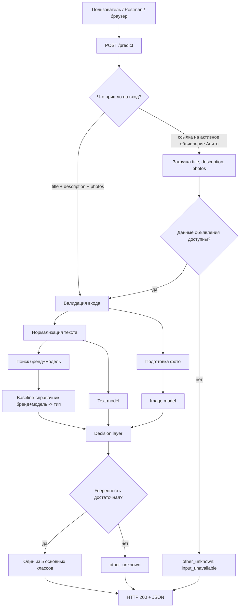

# Схема решения и метрики

Проект: автоматическое определение типа корпуса плёночной камеры по объявлению Авито.  
Категория: Электроника / Фототехника / Плёночные фотоаппараты.  
Целевой атрибут: `film_camera_body_type`.  
Папка этапа: `solution-design/`.


## Решение с примером использования

Нужно разработать сервис, который по тексту объявления, фотографиям и/или ссылке на активное объявление Авито определяет тип корпуса плёночной камеры. Если по данным нельзя уверенно выбрать один тип, сервис не угадывает, а возвращает `other_unknown`.

Сервис возвращает одно значение из фиксированного списка:

- `compact_point_and_shoot` - компактная плёночная камера / "мыльница"
- `SLR` - однообъективная зеркальная плёночная камера
- `rangefinder_viewfinder` - дальномерная, шкальная или видоискательная камера без зеркальной призмы
- `TLR` - двухобъективная зеркальная камера
- `instant` - камера моментальной печати, например Polaroid или Instax
- `other_unknown` - отказ от автозаполнения: данных мало, объект не камера, лот из разных камер или тип вне выбранной схемы

Общая схема решения:



Логика решения такая: сначала проверяем справочник "бренд+модель -> тип корпуса". Например, "Зенит TTL" почти всегда относится к `SLR`. Если справочник не даёт надёжного ответа: в объявлениях бывают бедные заголовки вроде "Фотоаппарат", опечатки, редкие модели и лоты - подключается модель по тексту и фото. Финальное правило решает, можно ли автозаполнить атрибут или лучше вернуть `other_unknown`.

Пример запроса с текстом и фото:

```bash
curl -X POST "https://film-camera-body-type.example.com/predict" \
  -F 'title=Canon EOS Elan 7 пленочный фотоаппарат' \
  -F 'description=Пленочная зеркальная камера, body без объектива' \
  -F 'photos=@canon_eos_elan_7.jpg'
```

Пример ответа:

```json
{
  "attribute": "film_camera_body_type",
  "value": "SLR",
  "decision": "auto_fill",
  "confidence": 0.96,
  "reason": "baseline_and_model_agree"
}
```

Пример запроса со ссылкой на объявление:

```bash
curl -X POST "https://film-camera-body-type.example.com/predict" \
  -H "Content-Type: application/json" \
  -d '{"url": "https://www.avito.ru/.../plenochnyy_fotoapparat_zorkiy_6"}'
```

Пример ответа:

```json
{
  "attribute": "film_camera_body_type",
  "value": "rangefinder_viewfinder",
  "decision": "auto_fill",
  "confidence": 0.91,
  "reason": "model_name_and_photo_agree"
}
```

Пример отказа:

```json
{
  "attribute": "film_camera_body_type",
  "value": "other_unknown",
  "decision": "abstain",
  "confidence": 0.41,
  "reason": "multi_item_lot_or_low_confidence"
}
```

Такой отказ нужен, например, если в объявлении продаётся "лот фотоаппаратов Зенит и Смена", потому что одному объявлению нельзя безопасно поставить один тип корпуса.


## Бизнес-метрика и критерий успеха

Цель простая: заполнить тип корпуса как можно чаще, но не портить каталог неверными значениями. Пустое поле лучше, чем неправильный тип: иначе объявление попадёт не в тот фильтр.

Поэтому я считаю две вещи: сколько строк заполнили правильно и сколько ошибок сделали среди заполненных.

Обозначения на ручной контрольной выборке:

```text
N = все объявления в контрольной выборке
A = объявления, где система вернула один из основных классов
C = объявления из A, где класс выбран правильно
W = объявления из A, где класс выбран ошибочно

AutoErrorRate = W / A
CorrectAutofillRate = C / N
```

Бизнес-метрика пилота:

```text
максимизируем CorrectAutofillRate
при ограничении AutoErrorRate <= 5%
```

Пилот считаем успешным, если:

```text
CorrectAutofillRate >= 70%
AutoErrorRate <= 5%
```

То есть система должна правильно и автоматически заполнить тип корпуса хотя бы для 70% объявлений контрольной выборки, а среди всех автозаполненных объявлений ошибаться не чаще чем в 5% случаев.

70% я взял как нижнюю планку полезности. Справочник уже закрывает часть популярных моделей, поэтому ML должен дать заметно больше, а не просто повторить справочник. При датасете примерно 60k объявлений 70% правильного автозаполнения - это около 42k объявлений с новым корректным параметром. При этом ограничение `AutoErrorRate` <= 5% защищает каталог от массовых неверных значений.


## ML-метрика

Для модели оставляю ту же логику, что и для продукта. Она может поставить один из пяти типов или отказаться через `other_unknown`. На проверке я выбираю порог так, чтобы среди заполненных строк было не больше 5% ошибок. Если таких порогов несколько, беру тот, где правильных автозаполнений больше.

Формально:

```text
max(C_tau / N)
при условии Precision_tau >= 95%
```

где `tau` - порог уверенности, `C_tau` - количество правильных автозаполнений после применения порога, `N` - размер ручной контрольной выборки.

Связь с бизнес-метрикой:

- `Precision` >= 95% соответствует бизнес-ограничению `AutoErrorRate` <= 5%;
- `C / N` соответствует доле объявлений, где параметр будет заполнен правильно;
- подбор порога даёт режим отказа `other_unknown`, который нужен для спорных объявлений.

Baseline без ML - справочник "бренд+модель -> тип корпуса", уже проверенный на этапе `problem-validation/`. Он считается на той же ручной отложенной выборке, что и ML-модель.

Модель считаю лучше справочника, если выполняются два условия:

```text
CorrectAutofillRate_ML >= max(0.70, CorrectAutofillRate_baseline + 0.07)
AutoErrorRate_ML <= 0.05
```

То есть модель должна не просто чуть улучшить справочник, а дать заметный прирост и не выйти за лимит ошибок. Справочник используется как измерительная линейка для прироста, а не как альтернатива продукту: на этапе аргументации проблемы уже видно, что им одним задачу не закрыть - он не покрывает бедные заголовки, редкие модели и лоты и требует ручной поддержки на 60k объявлений. Если модель не проходит это ограничение, значит её нельзя катить вместо справочника.